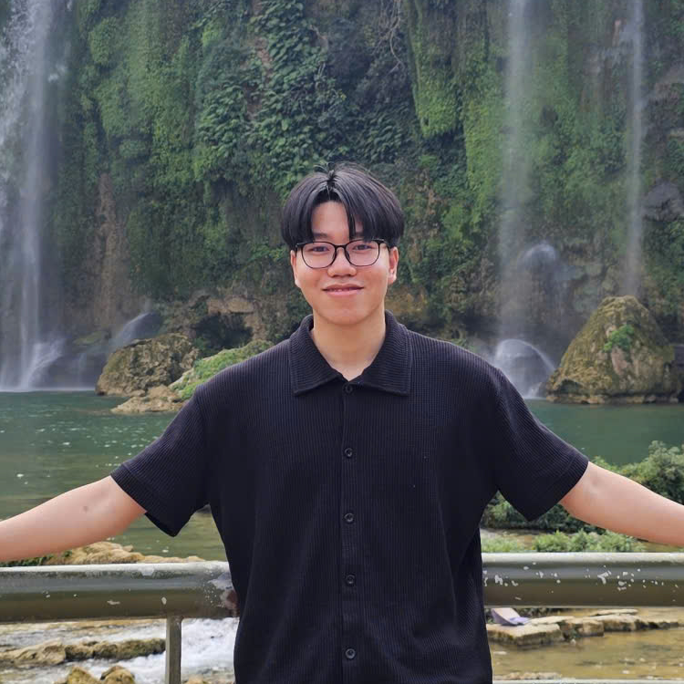

<!-- ========================= HERO / BLAUGRANA HEADER ========================= -->

  

<!-- LANGUAGE SWITCHER -->

  
  

 

  

<!-- FC Barcelona Blaugrana Badges -->

  
  
  
  

 

<!-- ========================= PHILOSOPHY ========================= -->

> *"Technology creates true value when it solves real-world challenges. Scientific research must go hand-in-hand with applied engineering, and knowledge multiplies only when shared across the community."* 💡

<!-- ========================= ABOUT ME ========================= -->
## 👨‍💻 About Me

<table width="100%">
  <tr>
    <td width="70%" valign="top">
      
I am a 3rd-year <b>Artificial Intelligence (AI)</b> undergraduate student at <b>FPT University Da Nang</b>, currently serving as the <b>Vice President of FU-DEVER Technology Club</b>. My trajectory centers on two synergistic pillars: <b>rigorous Computer Vision / Image Restoration / ML Systems research</b> and <b>community leadership</b>.

      <ul>
        <li>🎓 <b>Academic &amp; Research:</b> Specializing in <b>Underwater Image Restoration</b>, <b>Low-Light Image Enhancement (LLIE)</b>, and <b>Physics-Informed Deep Learning</b>. Authored <b>2 accepted conference papers</b> with reproducible benchmarks, solid metrics, and open-source implementations.</li>
        <li>🚀 <b>Leadership &amp; Community:</b> Vice President of <b>FU-DEVER Club</b> — co-organizing academic workshops, hackathons, and technical mentorships; Media Lead for the <i>Sunshine Team ("Bật Nụ Cười Lên")</i> charity project supporting underprivileged children at Da Nang Hope Village.</li>
        <li>⚽ <b>Lifestyle &amp; Interests:</b> Passionate <b>FC Barcelona fan (Blaugrana 🔴🔵)</b>; enjoy football, swimming, reading, music, and strategic gaming; certified <b>IELTS 6.0</b> (2024).</li>
      </ul>
      

        
        
        
      

    </td>
    <td width="30%" valign="middle" align="center">
      
       
      <i>Thai Hung Nguyen • AI Engineer &amp; Researcher</i>
    </td>
  </tr>
</table>

<!-- ========================= HONORS & AWARDS ========================= -->
## 🏆 Honors &amp; Awards

<table width="100%">
  <tr>
    <td width="50%" valign="top">
      <h4>🥉 Consolation Prize</h4>
      
<b>Research Festival 2026 / Research Connect</b> — FPT University Da Nang (May 2026)

      
Honored by the scientific committee for high-impact applied AI and Computer Vision image restoration research.

    </td>
    <td width="50%" valign="top">
      <h4>🥈 Second Prize</h4>
      
<b>Code Mosaic 2025 Programming Hackathon</b> — FPT University Da Nang (Oct 2025)

      
Annual competitive programming hackathon focused on Data Structures, Algorithms, and problem solving.

    </td>
  </tr>
  <tr>
    <td width="50%" valign="top">
      <h4>🥉 Consolation Prize (City Math Contest)</h4>
      
<b>Da Nang City Excellent Student Contest in Mathematics</b> (Jan 2024)

      
Awarded by the Da Nang Department of Education and Training in advanced mathematics.

    </td>
    <td width="50%" valign="top">
      <h4>📄 2 Accepted Conference Papers</h4>
      
<b>Underwater Image Restoration &amp; Low-Light Image Enhancement</b> (2026)

      
Two peer-reviewed research papers officially accepted for publication in scientific conference proceedings.

    </td>
  </tr>
</table>

<!-- ========================= TECH STACK ========================= -->
## 🛠 Tech Stack &amp; Tools

**🧠 Deep Learning, Computer Vision &amp; AI Research**

**💻 Languages, Data &amp; Web**

**🔧 Tools, Platforms &amp; Automation**

<!-- ========================= PROJECTS ========================= -->
## 🚀 Verified Projects

<!-- ----- Group 1: AI / Computer Vision Research (2 Accepted Papers) ----- -->

  

<table width="100%">
  <tr>
    <td width="50%" valign="top">
      <h4>🌊 Assessing Physics-Informed Priors in Underwater Image Restoration</h4>
      
Investigated physical priors for underwater image restoration using customized U-Net architectures. Formulated transmission map <i>t(x)</i> and backscatter map <i>B(x)</i> as auxiliary channels grounded in underwater optical formulation; evaluated RGB, RGB + <i>t(x)</i>, RGB + <i>B(x)</i>, and RGB + <i>t(x)</i> + <i>B(x)</i> configurations.

      
<b>Empirical Results:</b> Achieved <b>21.012 dB PSNR / 0.884 SSIM</b> on UIEB T90 and <b>26.644 dB PSNR / 0.873 SSIM</b> on EUVP-Test with the 5-channel model.

      

        
        
        
      

      <a href="https://github.com/huanight19RaH"><b>Research Details ↗</b></a>
    </td>
    <td width="50%" valign="top">
      <h4>💡 HybridLLIENet: Low-Light Image Enhancement</h4>
      
Explored low-light image enhancement via multi-space luminance prior fusion (LAB-L, HSV-V, YCbCr-Y) boosted with CLAHE and gamma correction on a U-Net restoration network. Comprehensive benchmarking across LOL datasets evaluating PSNR, SSIM, and perceptual LPIPS metrics.

      
<b>Empirical Results:</b> Reached <b>21.23 dB PSNR, 0.858 SSIM, 0.127 LPIPS</b> on LOLv2-Real with a lightweight footprint of only <b>8.04M parameters and 79.26 GFLOPs</b>.

      

        
        
        
      

      <a href="https://github.com/huanight19RaH"><b>Research Details ↗</b></a>
    </td>
  </tr>
</table>

<!-- ----- Group 2: Applied Engineering & ML Systems ----- -->

  

<table width="100%">
  <tr>
    <td width="50%" valign="top">
      <h4>🚦 Traffic Flow Detection — Video-Based Analytics Platform</h4>
      
End-to-end traffic video analytics system enabling multi-class vehicle detection, tracking, lane assignment, and tripwire counting. Architected video ingestion and frontend workflows: ROI lane configuration, real-time analytics streaming, and visual analytics dashboards. Integrated YOLO detection, ByteTrack tracker, and directional tripwire heuristics.

      
<b>Production Benchmark:</b> Attained <b>Event F1 0.942, WAPE 5.04%</b> on UA-DETRAC test sets, with batch throughput of <b>75.8 FPS (3.03x real-time)</b> and livestreaming at <b>14.9 FPS with 0% frame drop</b>.

      

        
        
        
        
      

      <a href="https://github.com/huanight19RaH"><b>Repo ↗</b></a>
    </td>
    <td width="50%" valign="top">
      <h4>📚 ScholarSummar — RAG-based Research Assistant</h4>
      
Intelligent scientific research assistant supporting academic PDF ingestion, hybrid lexical-dense search, and conversational document Q&A. Engineered RAG pipeline stages (text chunking, embedding generation, semantic retrieval), built frontend interfaces, wrote backend integration test suites, and managed Docker deployment.

      
<b>Infrastructure:</b> Containerized microservices integrating Next.js, FastAPI, PostgreSQL/pgvector, Redis cache, Qdrant vector database, MinIO object storage, and nginx.

      

        
        
        
        
      

      <a href="https://github.com/huanight19RaH"><b>Repo ↗</b></a>
    </td>
  </tr>
</table>

  

<!-- ========================= ANALYTICS & STREAK ========================= -->
## 📊 GitHub Analytics &amp; Streak

  
  
  

 

<!-- Streak stats Blaugrana theme -->

  

 

  

<!-- ========================= SNAKE GAME CONTRIBUTION GRAPH ========================= -->
## 🎮 Contribution Activity — Snake Game

  <picture>
    <source media="(prefers-color-scheme: dark)" srcset="https://raw.githubusercontent.com/huanight19RaH/huanight19RaH/output/github-contribution-grid-snake-dark.svg">
    <source media="(prefers-color-scheme: light)" srcset="https://raw.githubusercontent.com/huanight19RaH/huanight19RaH/output/github-contribution-grid-snake.svg">
    
  </picture>

<!-- ========================= CONNECT ========================= -->
## 📬 Let's Connect &amp; Collaborate

  
I am actively exploring AI/CV research collaborations, software engineering internships, and community building partnerships.

  
  
  
  

 

  

